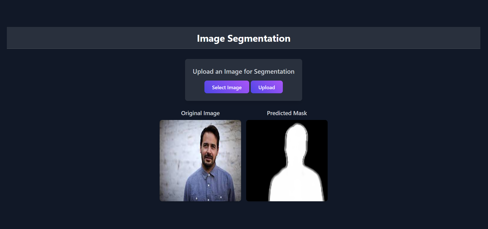

# 🖼️ Image Segmentation API

A RESTful API built with **Flask** that performs image segmentation using a pre-trained **TensorFlow** model.
Users can upload images and receive segmentation masks in response, encoded as PNG images in base64 format.
The API supports cross-origin requests via **Flask-CORS**.

---
## 📷 Screenshots

### 🏠 UI Page


---
## 🚀 Features

* 📤 Accepts image uploads via POST requests
* 🤖 Uses a TensorFlow model for image segmentation
* 🖼️ Returns segmentation masks as base64-encoded PNG images
* 🌐 CORS enabled for cross-domain access
* 🔄 Preprocesses input images by resizing and normalization

---

## 🛠️ Tech Stack

* **Backend**: Flask
* **Model**: TensorFlow / Keras
* **Image Processing**: Pillow (PIL), NumPy
* **CORS Support**: Flask-CORS

---

## ⚙️ Setup Instructions

1. **Clone the repo**

```bash
git clone https://github.com/Falgit1/Mask_Generation.git
cd Falgit1
```

2. **Install dependencies**

```bash
pip install -r requirements.txt
```

*Or manually install:*

```bash
pip install flask flask-cors tensorflow pillow numpy
```

3. **Place your model file**

Make sure the TensorFlow model file (`segmentation_VB.hdf5`) is located in `backend/model/` folder (or update the path accordingly).

4. **Run the Flask server**

```bash
python app.py
```

The server will start on `http://127.0.0.1:5000`.

---

## 🖼️ How to Use the API

Send a POST request to `/predict` with an image file in the form-data under the key `"image"`.

Example using `curl`:

```bash
curl -X POST -F "image=@path_to_your_image.png" http://127.0.0.1:5000/predict
```

Response:

```json
{
  "mask": "base64_encoded_png_image_string_here"
}
```

You can decode this base64 string to retrieve the segmentation mask image.

---

## 📂 Project Structure

* `app.py` — Flask application and API routes
* `backend/model/` — pre-trained TensorFlow segmentation model
* `requirements.txt` — Python dependencies

---

## 🙋‍♂️ Author

Developed by Falgit1

---

## 📄 License

This project is licensed under the MIT License.

